## SALES PREDICTION USING MACHINE LEARNING

Sales are crucial for companies for several reasons. Firstly, they
directly impact revenue, which is the lifeblood of any business. Revenue
generated from sales covers operational costs, investments, and
ultimately determines profitability. Secondly, sales are a key indicator
of customer demand and market interest in a company’s products or
services. Understanding customer preferences and trends helps in
refining offerings and staying competitive.

Analyzing how other resources affect sales is equally vital. It provides
insights into the efficiency and effectiveness of operations. For
example, marketing efforts directly influence a customer’s decision to
make a purchase. Proper allocation of resources ensures that these areas
are optimized, ultimately driving more sales. Additionally, monitoring
resource allocation helps in identifying areas that may need improvement
or reallocation, leading to better cost management and higher
profitability. By assessing the interplay between resources and sales, a
company can make informed decisions to enhance its overall performance
and competitiveness in the market.

### MAIN OBJECTIVE

The main objective of this project is to come up with
`prescriptive model` that will
`explain how different resources affect sales` and also come up with a
`predictive model` that will be `deployed with a shiny app` for users to
interact with it.

### METRICS FOR SUCCESS

The project will be considered a success if the prediction model has a
Mean Absolute Percentage Error of less than `10%`.

## DATA UNDERSTANDING

``` r
# importing the required libraries 

library(tidyverse)
library(dlookr)
library(MLmetrics)
library(corrplot)
library(caret)
library(performance)
```

``` r
# reading in the data 

df = read_csv("sales data.csv")
```

``` r
df %>% glimpse()
```

    ## Rows: 200
    ## Columns: 5
    ## $ Id        <dbl> 1, 2, 3, 4, 5, 6, 7, 8, 9, 10, 11, 12, 13, 14, 15, 16, 17, 1~
    ## $ TV        <dbl> 230.1, 44.5, 17.2, 151.5, 180.8, 8.7, 57.5, 120.2, 8.6, 199.~
    ## $ Radio     <dbl> 37.8, 39.3, 45.9, 41.3, 10.8, 48.9, 32.8, 19.6, 2.1, 2.6, 5.~
    ## $ Newspaper <dbl> 69.2, 45.1, 69.3, 58.5, 58.4, 75.0, 23.5, 11.6, 1.0, 21.2, 2~
    ## $ Sales     <dbl> 22.1, 10.4, 9.3, 18.5, 12.9, 7.2, 11.8, 13.2, 4.8, 10.6, 8.6~

``` r
# checking the first few rows of the dataset

df %>% head()
```

    ## # A tibble: 6 x 5
    ##      Id    TV Radio Newspaper Sales
    ##   <dbl> <dbl> <dbl>     <dbl> <dbl>
    ## 1     1 230.   37.8      69.2  22.1
    ## 2     2  44.5  39.3      45.1  10.4
    ## 3     3  17.2  45.9      69.3   9.3
    ## 4     4 152.   41.3      58.5  18.5
    ## 5     5 181.   10.8      58.4  12.9
    ## 6     6   8.7  48.9      75     7.2

``` r
# checking the last few rows of the dataset

df %>% tail()
```

    ## # A tibble: 6 x 5
    ##      Id    TV Radio Newspaper Sales
    ##   <dbl> <dbl> <dbl>     <dbl> <dbl>
    ## 1   195 150.   35.6       6    17.3
    ## 2   196  38.2   3.7      13.8   7.6
    ## 3   197  94.2   4.9       8.1   9.7
    ## 4   198 177     9.3       6.4  12.8
    ## 5   199 284.   42        66.2  25.5
    ## 6   200 232.    8.6       8.7  13.4

The data set has 200 instances and 5 columns. Columns include the Id
column of the instance, the amount of Tv spending, radio spending
amount, newspaper spending amount and sales(target variable)

``` r
# getting a summary of the dataset 

df %>% summary()
```

    ##        Id               TV             Radio          Newspaper     
    ##  Min.   :  1.00   Min.   :  0.70   Min.   : 0.000   Min.   :  0.30  
    ##  1st Qu.: 50.75   1st Qu.: 74.38   1st Qu.: 9.975   1st Qu.: 12.75  
    ##  Median :100.50   Median :149.75   Median :22.900   Median : 25.75  
    ##  Mean   :100.50   Mean   :147.04   Mean   :23.264   Mean   : 30.55  
    ##  3rd Qu.:150.25   3rd Qu.:218.82   3rd Qu.:36.525   3rd Qu.: 45.10  
    ##  Max.   :200.00   Max.   :296.40   Max.   :49.600   Max.   :114.00  
    ##      Sales      
    ##  Min.   : 1.60  
    ##  1st Qu.:10.38  
    ##  Median :12.90  
    ##  Mean   :14.02  
    ##  3rd Qu.:17.40  
    ##  Max.   :27.00

## DATA CLEANING

1.  **Checking and Dealing with Missing Values**: Handling missing data
    is crucial for accurate modeling. Techniques include imputation
    (filling missing values with estimates like mean, median, or mode),
    deletion (removing rows or columns with missing data), or using
    advanced methods like interpolation. Understanding the reason for
    missingness (e.g., random or systematic) can inform the choice of
    approach.

2.  **Checking for and Dealing with Duplicated Values**: Identifying and
    removing duplicate records is vital for maintaining data integrity.
    Duplicates can lead to biased results and overfitting. This process
    involves identifying identical rows and deciding whether to keep the
    first occurrence or remove duplicates entirely, based on the context
    of the dataset.

3.  **Checking if Dataset has Appropriate Data Types**: Ensuring that
    each column has the correct data type is crucial for efficient
    storage and accurate analysis. For instance, categorical variables
    should be represented as categories, dates as date objects, and
    numerical variables as appropriate numeric types (e.g., integers or
    floats). Incorrect data types can lead to errors or inefficient
    memory usage.

4.  **Checking and Dealing with Outliers**: Outliers can distort
    statistical analyses and model performance. Detecting outliers
    involves using techniques like visualizations (box plots, scatter
    plots) and statistical tests. Depending on the context, outliers can
    be removed, transformed, or analyzed separately. Robust modeling
    techniques, like Random Forests or Support Vector Machines, can
    handle outliers better than some other models.

1.`Checking and dealing with missing values`

``` r
# checking for duplicated values in the dataset

df %>% diagnose() %>% select(missing_count, missing_percent)
```

    ## # A tibble: 5 x 2
    ##   missing_count missing_percent
    ##           <int>           <dbl>
    ## 1             0               0
    ## 2             0               0
    ## 3             0               0
    ## 4             0               0
    ## 5             0               0

For the dataset, there are `zero` cases of missing values.

2.`Checking for duplicated values`

``` r
# checking for duplicated values 

df %>% duplicated() %>%  sum()
```

    ## [1] 0

There are no duplicates in the dataset

3.`Checking if the dataset has the correct column types`

``` r
# checking for column types 

df %>% diagnose() %>% select(variables, types)
```

    ## # A tibble: 5 x 2
    ##   variables types  
    ##   <chr>     <chr>  
    ## 1 Id        numeric
    ## 2 TV        numeric
    ## 3 Radio     numeric
    ## 4 Newspaper numeric
    ## 5 Sales     numeric

All the columns have the expected data types and there is no need to
convert them.

4.`Checking for outliers`

``` r
# dropping the id column as it does provide any information

df <- df %>% select(-Id)
```

``` r
# checking for outliers 

df %>% diagnose_outlier()
```

    ## # A tibble: 4 x 6
    ##   variables outliers_cnt outliers_ratio outliers_mean with_mean without_mean
    ##   <chr>            <int>          <dbl>         <dbl>     <dbl>        <dbl>
    ## 1 TV                   0              0          NaN      147.         147. 
    ## 2 Radio                0              0          NaN       23.3         23.3
    ## 3 Newspaper            2              1          107.      30.6         29.8
    ## 4 Sales                0              0          NaN       14.0         14.0

``` r
## plot the outliers 

df %>% select(Newspaper) %>% plot_outlier()
```

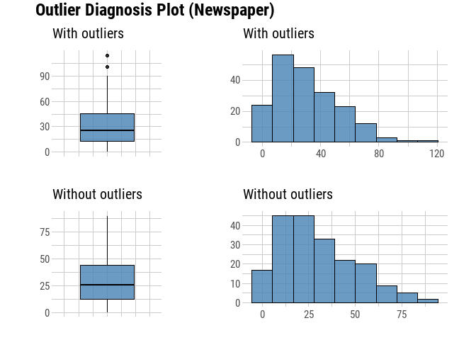<!-- -->

``` r
# writing a function to remove outliers 

remove_outliers <- function(data) {
  data %>%
    mutate(across(everything(), ~ ifelse(. > quantile(., 0.99), NA, .))) %>%
    drop_na()
}
```

``` r
# removing outliers 

new_df <- remove_outliers(df)
```

``` r
# checking if there are outliers 

new_df %>% diagnose_outlier()
```

    ## # A tibble: 4 x 6
    ##   variables outliers_cnt outliers_ratio outliers_mean with_mean without_mean
    ##   <chr>            <int>          <dbl>         <dbl>     <dbl>        <dbl>
    ## 1 TV                   0              0           NaN     144.         144. 
    ## 2 Radio                0              0           NaN      22.7         22.7
    ## 3 Newspaper            0              0           NaN      29.6         29.6
    ## 4 Sales                0              0           NaN      13.8         13.8

## EXPLORATORY DATA ANALYSIS

### UNIVARIATE ANALYSIS

``` r
# boxplot of TV 

ggplot(new_df, aes(TV))+
  geom_boxplot(fill="peachpuff") +
  labs(title = "Distribution of TV ",
       subtitle = "The boxplots shows that TV is normally distributed ") +
  theme_minimal()
```

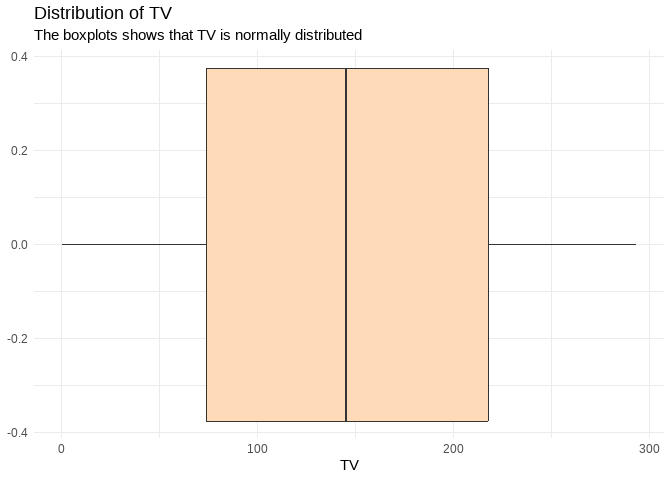<!-- -->

``` r
# boxplot of Radio 

ggplot(new_df, aes(Radio))+
  geom_boxplot(fill="lavender") +
  labs(title = "Distribution of Radio",
       subtitle = "The boxplots shows that Radio is normally distributed ") +
  theme_minimal()
```

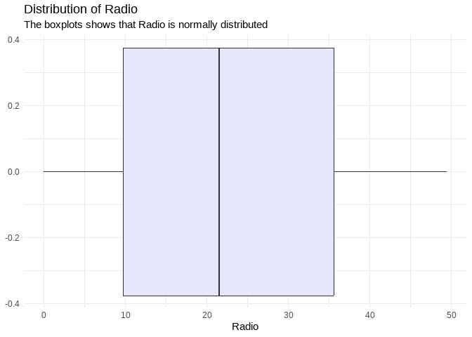<!-- -->

``` r
# boxplot of newspaper

ggplot(new_df, aes(Newspaper))+
  geom_boxplot(fill="palegreen") +
  labs(title = "Distribution of newspaper ",
       subtitle = "The boxplots shows that newspaper is positively skewed ") +
  theme_minimal()
```

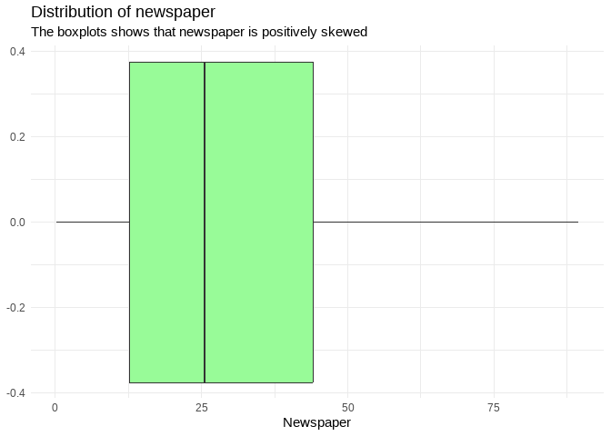<!-- -->

``` r
# boxplot of sales

ggplot(new_df, aes(Sales))+
  geom_boxplot(fill="azure") +
  labs(title = "Distribution of Sales ",
       subtitle = "The boxplots shows that Sales is normally distributed ") +
  theme_minimal()
```

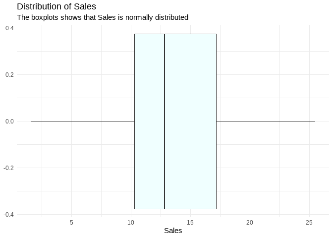<!-- -->

### BIVARIATE ANALYSIS

``` r
# Sales vs TV 

ggplot(new_df, aes(Sales, TV)) +
  geom_point(color="red") +
  labs(title = "Sales Vs TV",
       subtitle = "There is evidence of a linear relationship between sales and tv spending") + 
  theme_minimal()
```

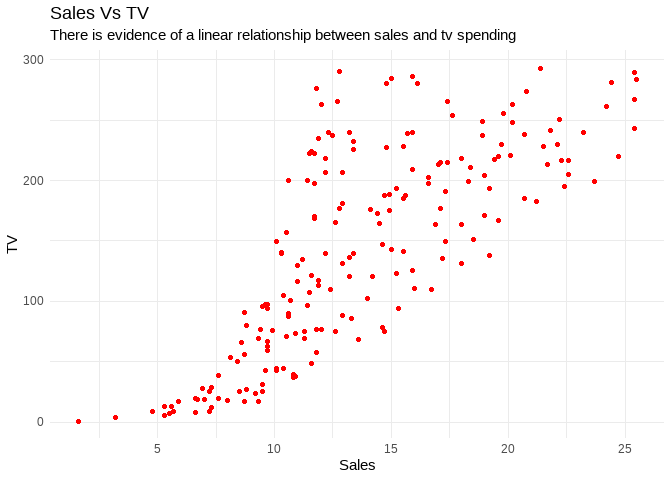<!-- -->

``` r
# Sales vs Radio

ggplot(new_df, aes(Sales, Radio)) +
  geom_point(color="red") +
  labs(title = "Sales Vs Radio",
       subtitle = "There is evidence of some linear relationship between sales and Radio spending") + 
  theme_minimal()
```

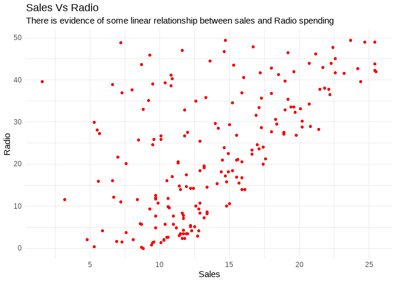<!-- -->

``` r
# Sales vs Newspaper

ggplot(new_df, aes(Sales, Newspaper)) +
  geom_point(color="red") +
  labs(title = "Sales Vs Newspaper",
       subtitle = "There is evidence of little or no linear relationship between sales and newspaper spending") + 
  theme_minimal()
```

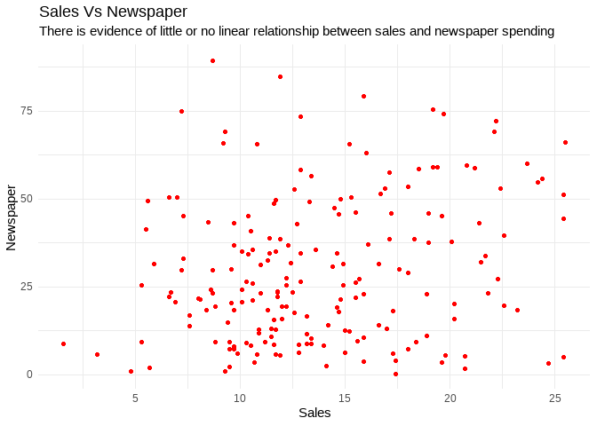<!-- -->

### MULTIVARIATE ANALYSIS

For multivariate analysis, correlations will be investigated.

``` r
M <- cor(new_df)
corrplot(M, order = 'AOE', addCoef.col = 'black', tl.pos = 'd',
         cl.pos = 'n', col = COL2('PiYG'))
```

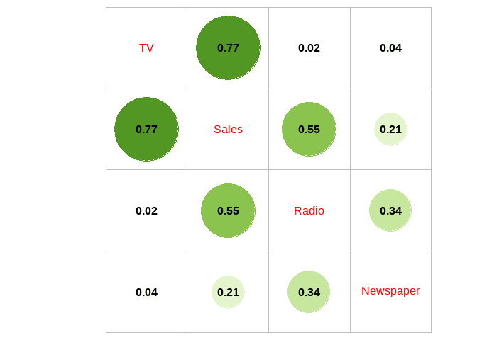<!-- -->

From the plot, it is evident that Tv spending has the strongest positive
correlation with sales with a correlation of 0.77. Other variables have
moderate or weak positive correlations.

Additionally, it can also be said that there are no alarming
multicollinearity between the predictor variables.

## MODELLING

The modelling process will involve;

- Splitting data to training and testing

- Fitting an initial model with all the predictors

- Removing non-significant predictor using the p-value and fitting a
  second model

- Adding some interaction terms and test if they significantly improve
  the accuracy of the model

- Checking model diagnostics for the final model

``` r
# splitting data to training and testing set

split <- createDataPartition(new_df$Sales, p=0.8, list = FALSE)

train_set <- df[split,]

test_set <- df[-split,]
```

``` r
# Fitting an initial model 

initial_model <- lm(Sales ~., data = train_set)
```

``` r
# Summary of the model

summary(initial_model)
```

    ## 
    ## Call:
    ## lm(formula = Sales ~ ., data = train_set)
    ## 
    ## Residuals:
    ##     Min      1Q  Median      3Q     Max 
    ## -4.4870 -0.8001  0.2575  1.0602  2.7744 
    ## 
    ## Coefficients:
    ##             Estimate Std. Error t value Pr(>|t|)    
    ## (Intercept) 2.934399   0.317179   9.252   <2e-16 ***
    ## TV          0.043791   0.001404  31.199   <2e-16 ***
    ## Radio       0.199221   0.008735  22.807   <2e-16 ***
    ## Newspaper   0.001211   0.005862   0.207    0.837    
    ## ---
    ## Signif. codes:  0 '***' 0.001 '**' 0.01 '*' 0.05 '.' 0.1 ' ' 1
    ## 
    ## Residual standard error: 1.494 on 153 degrees of freedom
    ## Multiple R-squared:  0.9159, Adjusted R-squared:  0.9143 
    ## F-statistic: 555.5 on 3 and 153 DF,  p-value: < 2.2e-16

`Newspaper` had a large p-value an indication that it is perphaps not a
strong predictor of sales and will therefore be dropped from the model.

``` r
# second model with newspaper dropped

second_model <- lm(Sales ~ TV + Radio, data = new_df)
```

``` r
#summary of second model

summary(second_model)
```

    ## 
    ## Call:
    ## lm(formula = Sales ~ TV + Radio, data = new_df)
    ## 
    ## Residuals:
    ##     Min      1Q  Median      3Q     Max 
    ## -8.7817 -0.8890  0.3101  1.1857  2.7509 
    ## 
    ## Coefficients:
    ##             Estimate Std. Error t value Pr(>|t|)    
    ## (Intercept) 3.043363   0.302280   10.07   <2e-16 ***
    ## TV          0.045263   0.001437   31.50   <2e-16 ***
    ## Radio       0.184511   0.008251   22.36   <2e-16 ***
    ## ---
    ## Signif. codes:  0 '***' 0.001 '**' 0.01 '*' 0.05 '.' 0.1 ' ' 1
    ## 
    ## Residual standard error: 1.685 on 191 degrees of freedom
    ## Multiple R-squared:  0.8882, Adjusted R-squared:  0.8871 
    ## F-statistic: 758.9 on 2 and 191 DF,  p-value: < 2.2e-16

The hypothesis posits the potential interaction between radio and TV
expenditures in driving sales. Consequently, an interaction term
encompassing both radio and TV will be incorporated to examine the
presence of such an interaction.

``` r
# interaction term model

interaction_model <- lm(Sales ~ TV + Radio + TV*Radio, data = new_df)
```

``` r
# summary of the model 

summary(interaction_model)
```

    ## 
    ## Call:
    ## lm(formula = Sales ~ TV + Radio + TV * Radio, data = new_df)
    ## 
    ## Residuals:
    ##     Min      1Q  Median      3Q     Max 
    ## -6.2306 -0.4165  0.1796  0.5823  1.4837 
    ## 
    ## Coefficients:
    ##              Estimate Std. Error t value Pr(>|t|)    
    ## (Intercept) 6.776e+00  2.476e-01  27.367  < 2e-16 ***
    ## TV          1.884e-02  1.513e-03  12.452  < 2e-16 ***
    ## Radio       2.552e-02  8.990e-03   2.839  0.00501 ** 
    ## TV:Radio    1.119e-03  5.434e-05  20.588  < 2e-16 ***
    ## ---
    ## Signif. codes:  0 '***' 0.001 '**' 0.01 '*' 0.05 '.' 0.1 ' ' 1
    ## 
    ## Residual standard error: 0.9397 on 190 degrees of freedom
    ## Multiple R-squared:  0.9654, Adjusted R-squared:  0.9649 
    ## F-statistic:  1767 on 3 and 190 DF,  p-value: < 2.2e-16

As hypothesized, the interaction term between tv and radio is a
significant confirming the interaction between radio and tv in
influencing sales. Additionally, the R-squared improved from `88%` to
`96%`.

An anova test will be conducted to confirm if need the model with the
interaction term is better than the model without the interaction term.

``` r
anova(second_model, interaction_model)
```

    ## Analysis of Variance Table
    ## 
    ## Model 1: Sales ~ TV + Radio
    ## Model 2: Sales ~ TV + Radio + TV * Radio
    ##   Res.Df    RSS Df Sum of Sq      F    Pr(>F)    
    ## 1    191 542.06                                  
    ## 2    190 167.78  1    374.28 423.85 < 2.2e-16 ***
    ## ---
    ## Signif. codes:  0 '***' 0.001 '**' 0.01 '*' 0.05 '.' 0.1 ' ' 1

The Residual Sum of Squares (RSS) for Model 1 is 542.06, whereas for
Model 2 it is 167.78. The change in Residual Sum of Squares (ΔRSS) is
374.28. The F-statistic is 423.85, which indicates a highly significant
improvement in model fit when including the interaction term. The
p-value associated with the F-statistic is extremely low (Pr(\>F) \<
2.2e-16), indicating strong evidence against the null hypothesis that
the interaction term has no effect. Adding the interaction term (TV \*
Radio) significantly improves the model’s ability to explain the
variation in sales compared to the model without it. This suggests that
there is likely an interaction between TV and Radio advertising
expenditures in influencing sales.

### MODEL DIAGNOSTICS FOR THE FINAL MODEL

1.  `Heteroskedasticity`

``` r
# checking heteroskedasticity

interaction_model %>% check_heteroscedasticity() %>% plot()
```

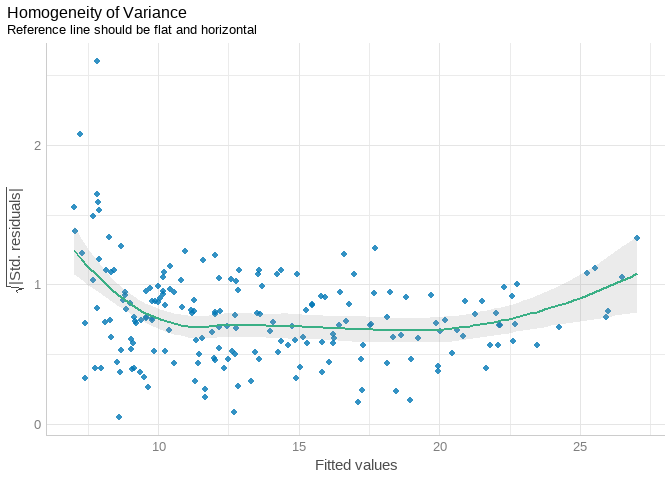<!-- -->

From the residual plot, there seems to be little concern that model is
suffering from `heteroskedasticity`

2.  `Normality of residuals`

``` r
# checking for normality of residuals 

interaction_model %>% check_normality() %>% plot()
```

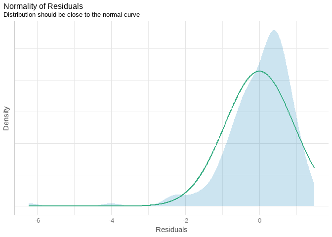<!-- -->

From the plot, the residuals are normally distributed

``` r
# check for influential observations

interaction_model %>% check_outliers() %>% plot()
```

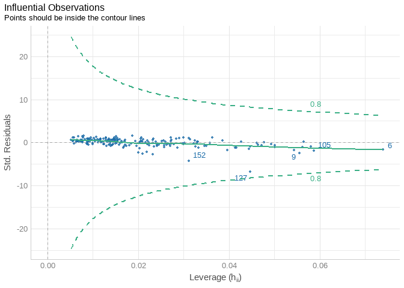<!-- -->

There is little concern that just a few observations would have a
significant shift in the line of fit for the model.

``` r
# check for multicollinearity

interaction_model %>% check_collinearity()
```

    ## # Check for Multicollinearity
    ## 
    ## Low Correlation
    ## 
    ##   Term  VIF   VIF 95% CI Increased SE Tolerance Tolerance 95% CI
    ##     TV 3.56 [2.85, 4.55]         1.89      0.28     [0.22, 0.35]
    ##  Radio 3.82 [3.04, 4.88]         1.95      0.26     [0.20, 0.33]
    ## 
    ## Moderate Correlation
    ## 
    ##      Term  VIF   VIF 95% CI Increased SE Tolerance Tolerance 95% CI
    ##  TV:Radio 6.48 [5.07, 8.37]         2.54      0.15     [0.12, 0.20]

There are no alarming signs that the model predictors have high
correlations between themselves that would warrant any of them to be
dropped from the model.

### SAVING MODEL FOR USE IN SHINY APP

``` r
# saving model 

write_rds(interaction_model, "salesmodel.rds")
```

### MODEL COEFFICIENTS INTREPRETATION

- TV (0.01884): For every one unit increase in TV advertising
  expenditure, we expect sales to increase by approximately 0.01884
  units, holding other variables constant.

- Radio (0.02552): For every one unit increase in Radio advertising
  expenditure, we expect sales to increase by approximately 0.02552
  units, holding other variables constant.

- <TV:Radio> Interaction (0.001119): This coefficient represents the
  additional effect on sales when both TV and Radio advertising
  expenditures increase together by one unit. In this case, the
  interaction term suggests a positive synergistic effect - that is, the
  combined effect of TV and Radio advertising expenditures is greater
  than the sum of their individual effects.

## RECCOMMENDATIONS

1.  **Optimize TV Advertising Expenditure**

Given that a one-unit increase in TV advertising expenditure is
associated with an approximate 0.01884-unit increase in sales (while
holding other factors constant), consider allocating resources to
optimize TV advertising strategies. Focus on channels, time slots, or
programs that have shown effectiveness in driving sales.

2.  **Leverage Radio Advertising**

Increase efforts in radio advertising, as a one-unit increase in radio
advertising expenditure is associated with an approximate 0.02552-unit
increase in sales (while holding other factors constant). This channel
has demonstrated a positive impact on sales and should continue to be
part of the marketing strategy.

3.  **Explore Synergistic Opportunities**

Given the presence of a significant interaction effect between TV and
Radio advertising, consider exploring synergistic advertising campaigns
that utilize both TV and Radio together. This combination seems to have
a positive, amplified effect on sales compared to using them
individually.

4.  **Monitor and Adjust Campaigns**

Continuously monitor the performance of advertising campaigns and adjust
strategies as needed. This may involve reallocating resources based on
the effectiveness of each channel and considering the interplay between
TV and Radio advertising.
